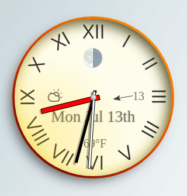

# Style Clock

This is an HTML / CSS / Javasript feature clock including moon phase, weather information, and date display. The clock's design is entirely defined in a single CSS file, allowing the clock to be rethemed by changing one file. There is one dependency for formatting the calendar text, but the javascript code can handle two options - the popular moment.js library, or the lightweight day.js library.

This clock was originally created as a desktop clock widget, using the Chrome plugin Flobro to float the page in a borderless resizeable window.

## Getting Started

Drop the contents of this repository into your web page project. The test.html file contains the "clockface" div, which has all the elements used to draw the clock.

In the test.html code the size and position of the clock are set using style parameters. As an alternative, you can set the size in the clock.css file and let the clock be positioned by a container div in your page's html structure.

### Prerequisites

Example code is included in the test file to pull in the moment.js or day.js files from a CDN.

To get weather information you will need to get an api key from [OpenWeather](https://openweathermap.org/). The free API subscription will be more than adequate for personal use, the default refresh rate for weather in the clock.js code is set for one update every ten minutes.

The weather api key can be copied into the const declaration at the top of the clock.js file. In my copy I have moved the key out to a git-ignored json file "apikey.txt" simply to avoid accidentally pushing it to this repository.

## Contributing

The old-timey look in clock.css is just one simple example of how the clock can be styled. I'd welcome contributions of more themes, preferably ones that do not change the base clockface elements structure, but if something has to change - let's talk.

This is my first project where I have consciously tried to write consistent ES6 code without any help from jQuery or similar libraries; suggestions for simplifying the code and taking advantage of new javascript features are welcomed.

## License

This project is licensed under the MIT License - see the [LICENSE.txt](LICENSE.txt) file for details

## Acknowledgments

With thanks to authors of the following resources
* The moon phase calculation is derived from [endel/getMoonPhase.js](https://gist.github.com/endel/dfe6bb2fbe679781948c)
* The weather icons come from [ HerzScheisse /
org.openhab.ui.iconset.climacons ](https://github.com/HerzScheisse/org.openhab.ui.iconset.climacons)

